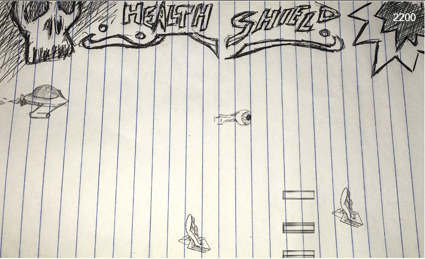

<h2 style="text-align:center">SIDESHOT<h2>

This is the story of a kid bored in class, that decides to doodle on his notebook paper instead of taking notes.  He eventually falls asleep and finds himself in a dream of his creation!  Playing the part of his spaceship doodle that shoots eyeballs, you fight mathbooks, rulers and other school related enemies that flood the screen.

First game I built with Phaser.js

<h3>Install -</h3>
    <ul>
        <li>Clone or download the repo</li>
        <li><code>cd SIDESHOT</code></li>
        <li>start the server: <code>node server.js</code></li>
    </ul>

<h3>How to Play -</h3>
    <ul>
        <li>Open browser after starting the local server and navigate to <code>localhost:8000</code></li>
        <li>Hit the <code>SPACEBAR</code> to get started</li>
        <li>the spaceship tries to follow the <code>Mouse</code> and shoots with <code>SPACEBAR</code></li>
        <li>When you've died, hit the <code>SPACEBAR</code> to reset the game</li>
    </ul>

<h3>Known Bugs / TODO List -</h3>
    <ul>
        <li>Sound doesnt activate until spaceship shoots for the first time</li>
        <li>Healthbar and Shieldbar should fill with respective colors (red, blue) for visiblity on health and sheild</li>
        <li>Sheild values/functions dont actually exist in code</li>
        <li>Code needs to be restructured before it turns into spaghetti</li>
        <li>Add more types of enemies, new wave patterns of movement, and maybe some of them should shoot</li>
        <li>Maybe add levels instead of endless mode with increasing amounts of enemies</li>
        <li>Make 'Boss' (Enemy/Enemies): Thinking it could be the teacher "waking" the student with maybe different waves of numbers, letters, equations</li>
    </ul>
